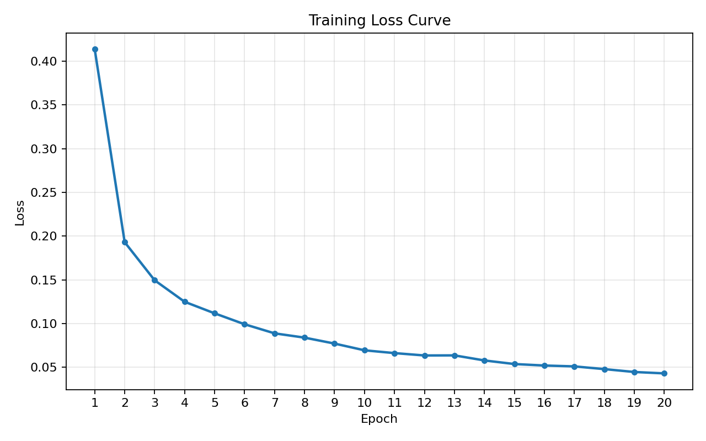

# MNIST 손글씨 숫자 인식 과제 보고서

## 0. 팀원

| 항목 | 내용 |
| --- | --- |
| 팀 | 303호 5팀 |
| 팀원 | 최영빈, 조범상, 임재환, 윤형민 |

---

## 1. 실험 목적

이번 과제의 목적은 PyTorch, TensorFlow 같은 딥러닝 프레임워크 없이 NumPy만 사용하여 MNIST 손글씨 숫자 분류 신경망을 직접 구현하는 것이다.

구현 과정에서는 단순히 정확도만 확인하는 것이 아니라, `Forward -> Loss -> Backward -> Optimizer Update` 흐름이 각 계층과 학습 루프에서 어떻게 연결되는지 확인한다. 최종 목표는 MNIST 테스트 정확도 95% 이상이며, 가능하면 97% 이상을 달성하는 것이다.

---

## 2. 모델 구조

현재 구현한 모델은 28x28 이미지를 784차원 벡터로 펼친 뒤, 두 개의 은닉층과 하나의 출력층을 통과하는 다층 퍼셉트론(MLP) 구조이다.


| 구분 | 내용 |
| --- | --- |
| 입력 | 784차원 벡터, MNIST 28x28 이미지를 펼친 값 |
| 은닉층 1 | Affine(784 -> 512) -> BatchNorm -> ReLU -> Dropout |
| 은닉층 2 | Affine(512 -> 256) -> BatchNorm -> ReLU -> Dropout |
| 출력층 | Affine(256 -> 10) -> Softmax |
| 출력 | 각 숫자 클래스 0~9에 대한 확률 |
| 손실 함수 | Cross Entropy Loss |

모델의 전체 흐름은 다음과 같다.

```text
Input(784)
-> Affine(512)
-> BatchNorm
-> ReLU
-> Dropout
-> Affine(256)
-> BatchNorm
-> ReLU
-> Dropout
-> Affine(10)
-> Softmax
```

### 구현한 주요 구성 요소

| 파일 | 구현 내용 |
| --- | --- |
| `src/activations.py` | `ReLU`, `Softmax` |
| `src/layers.py` | `Affine`, `BatchNorm`, `Dropout` |
| `src/losses.py` | `cross_entropy_loss` |
| `src/optimizers.py` | `SGD`, `Adam` |
| `src/network.py` | `NeuralNetwork` 모델 구성, forward/backward/loss/predict |
| `src/training.py` | mini-batch 학습 루프, 평가 함수, loss curve 출력 함수 |
| `src/util.py` | 학습 데이터와 라벨을 같은 순서로 섞는 `shuffle_dataset` |

### Forward 흐름

`NeuralNetwork.forward()`는 `OrderedDict`에 저장된 layer를 순서대로 실행한다. `BatchNorm`과 `Dropout`은 학습 모드와 평가 모드에서 동작이 다르기 때문에 `train` 인자를 전달한다. 마지막에는 `Softmax`를 적용하여 각 클래스의 확률을 반환한다.

### Backward 흐름

학습 루프에서는 `Softmax + CrossEntropy`를 합친 gradient를 직접 만든다.

```python
dout = y_pred.copy()
dout[np.arange(x_batch.shape[0]), y_batch] -= 1
dout = dout / x_batch.shape[0]
```

이후 `model.backward(dout)`을 호출하여 출력층부터 입력층 방향으로 gradient를 전파하고, 각 파라미터의 gradient를 `model.grads`에 저장한다.

### Optimizer Update

`optimizer.update(model.params, grads)`는 반환값을 사용하지 않고 `model.params`를 직접 갱신한다. 현재 기본 학습 설정에서는 Adam optimizer를 사용한다.

---

## 3. 학습 설정

현재 코드와 노트북에서 사용할 기본 학습 설정은 다음과 같다.

| 항목 | 값 |
| --- | --- |
| optimizer | Adam |
| learning rate | 0.001 |
| epochs | 20 |
| batch_size | 128 |
| Dropout ratio | 0.5 |
| BatchNorm momentum | 0.9 |
| weight initialization | He initialization |
| bias initialization | 0 |
| 입력 정규화 | 0~1 범위 |

---

## 4. 실험 환경

과제 문서의 기준 환경은 Python 3.11 계열 Conda 환경이다.

| 항목 | 내용 |
| --- | --- |
| 기준 Python | Python 3.11 |
| 사용 라이브러리 | NumPy, Matplotlib, pytest |
| 실행 환경 | 로컬 Windows, Conda `mnist-nn`, Python 3.11.15 |
| 학습 시간 | 392.8926초, 약 6분 32.89초 |

최종 단위 테스트와 학습은 다음 환경에서 수행했다.

| 항목 | 값 |
| --- | --- |
| Python | 3.11.15 |
| NumPy | 2.4.6 |
| Matplotlib | 3.10.9 |
| pytest | 9.0.3 |

README 기준에 맞게 Python 3.11 계열 Conda 환경에서 최종 테스트와 학습 결과를 측정했다.

---

## 5. 결과

### 5.1 단위 테스트 결과

현재 구현에 대해 전체 단위 테스트를 실행한 결과는 다음과 같다.

| 항목 | 내용 |
| --- | --- |
| 실행 명령 | `pytest tests/ -q` |
| 결과 | `21 passed` |
| 실행 시간 | 약 0.85초 |

검증된 테스트 범위는 다음과 같다.

| 테스트 | 검증 내용 |
| --- | --- |
| `test_relu.py` | ReLU forward/backward |
| `test_softmax.py` | Softmax forward/backward |
| `test_affine.py` | Affine forward/backward |
| `test_cross_entropy_loss.py` | Cross Entropy Loss |
| `test_sgd.py` | SGD update |
| `test_adam.py` | Adam update |
| `test_neural_network.py` | 모델 forward/loss/backward 연결 |
| `test_batchnorm.py` | BatchNorm forward/backward |
| `test_dropout.py` | Dropout forward/backward |
| `test_training.py` | mini-batch 학습 루프 |
| `test_evaluate.py` | 평가 함수 |

### 5.2 모델 파라미터 수

현재 기본 모델 설정에서 학습 가능한 파라미터 수는 다음과 같다.

| 항목 | 값 |
| --- | --- |
| 총 파라미터 수 | 537,354 |

파라미터 구성은 다음과 같다.

| 파라미터 | shape | 개수 |
| --- | --- | --- |
| `W1` | `(784, 512)` | 401,408 |
| `b1` | `(512,)` | 512 |
| `W2` | `(512, 256)` | 131,072 |
| `b2` | `(256,)` | 256 |
| `W3` | `(256, 10)` | 2,560 |
| `b3` | `(10,)` | 10 |
| `gamma1` | `(512,)` | 512 |
| `beta1` | `(512,)` | 512 |
| `gamma2` | `(256,)` | 256 |
| `beta2` | `(256,)` | 256 |

### 5.3 MNIST 실제 학습 및 평가 결과

#### 5.3.1 연습 실행 결과

최종 학습 전에 전체 학습 파이프라인이 실제 MNIST 데이터에서 동작하는지 확인하기 위해 1 epoch만 학습했다.

| 항목 | 값 |
| --- | --- |
| 학습 데이터 | MNIST train set, 60,000개 |
| 테스트 데이터 | MNIST test set, 10,000개 |
| epochs | 1 |
| batch_size | 128 |
| optimizer | Adam |
| learning rate | 0.001 |
| Dropout ratio | 0.5 |
| train loss | 0.4135 |
| test accuracy | 95.63% |
| 총 파라미터 수 | 537,354 |
| 학습 및 평가 시간 | 약 28.88초 |

1 epoch만 학습했음에도 테스트 정확도 95.63%를 기록하여, 구현한 학습 루프와 평가 함수가 실제 MNIST 데이터에서도 정상적으로 동작함을 확인했다.

#### 5.3.2 최종 학습 결과

최종 학습은 동일한 모델을 새로 초기화한 뒤, MNIST 학습 데이터 전체를 20 epoch 동안 반복 학습하여 수행했다.

| 항목 | 값 |
| --- | --- |
| 학습 데이터 | MNIST train set, 60,000개 |
| 테스트 데이터 | MNIST test set, 10,000개 |
| seed | 42 |
| epochs | 20 |
| batch_size | 128 |
| optimizer | Adam |
| learning rate | 0.001 |
| BatchNorm | 사용 |
| Dropout | 사용 |
| Dropout ratio | 0.5 |
| 초기 train loss | 0.4139 |
| 최종 train loss | 0.0430 |
| test accuracy | 98.52% |
| 총 파라미터 수 | 537,354 |
| 데이터 로드 시간 | 2.3784초 |
| 학습 시간 | 392.8926초, 약 6분 32.89초 |
| 평가 시간 | 0.2186초 |
| 학습 및 평가 시간 | 393.1112초, 약 6분 33.11초 |

최종 실행에서 테스트 정확도 98.52%를 기록하여 과제 목표인 95% 이상과 권장 목표인 97% 이상을 모두 달성했다.

### 5.4 Loss Curve

연습 실행에서는 1 epoch만 학습했기 때문에 loss curve 대신 단일 loss 값만 기록했다.

| 실행 | Epoch | Loss |
| --- | --- | --- |
| 연습 실행 | 1 | 0.4135 |

최종 학습의 epoch별 loss는 다음과 같다.



loss는 1 epoch의 0.4139에서 20 epoch의 0.0430까지 전반적으로 감소했다.

---

## 6. 회고

현재 구현을 통해 확인한 내용은 다음과 같다.

- Forward 단계에서는 각 layer가 입력을 받아 다음 layer로 전달하고, backward에서 필요한 중간 값을 저장해야 한다.
- Cross Entropy Loss는 정답 클래스의 예측 확률에 `log`를 적용하여 계산하며, `np.clip`으로 `log(0)`을 방지했다.
- Softmax와 Cross Entropy를 함께 사용할 때는 `y_pred`에서 정답 클래스 위치만 1을 빼는 방식으로 출력층 gradient를 만들 수 있다.
- BatchNorm은 학습 시 현재 batch의 평균과 분산을 사용하고, 평가 시 running mean과 running variance를 사용한다.
- Dropout은 학습 시 무작위 mask를 적용하고, 평가 시 고정 비율로 scale한다.
- Optimizer는 gradient를 사용해 `model.params`를 직접 갱신하며, `update()`의 반환값은 사용하지 않는다.

- 1 epoch 연습 실행에서는 테스트 정확도 95.63%를 기록하여 학습 파이프라인이 정상 동작함을 확인했다.
- 20 epoch 최종 학습에서는 테스트 정확도 98.52%를 기록하여 최소 목표 95%와 권장 목표 97%를 모두 달성했다.
- loss는 0.4139에서 0.0430까지 감소하여 학습이 정상적으로 진행되었음을 확인했다.
- 기본 설정만으로 목표 정확도를 넘었기 때문에 별도의 하이퍼파라미터 탐색은 수행하지 않았다.
- 추가 개선을 한다면 Dropout ratio, learning rate, epoch 수를 비교하여 정확도와 과적합 여부를 함께 확인할 수 있다.

---

## 7. 실제 테스트 및 기록 방법

### 7.1 단위 테스트 실행

구현한 각 구성 요소가 테스트를 통과하는지 확인한다.

```powershell
pytest tests/ -v
```

보고서에는 다음 항목을 기록한다.

```text
실행 명령: pytest tests/ -v
결과: 전체 테스트 통과 여부
통과 개수: 예) 21 passed
실행 환경: Python 버전, pytest 버전
```

### 7.2 MNIST 데이터 준비

`data/mnist.npz`가 없다면 먼저 데이터를 다운로드한다.

```powershell
python download_mnist.py
```

### 7.3 실제 학습 및 평가 실행

`mnist_lab.ipynb`에서 학습 셀을 실행하거나, 아래 흐름과 같은 코드를 실행한다.

```python
import time

from data import load_mnist
from network import NeuralNetwork
from optimizers import Adam
from training import train, evaluate

(x_train, y_train), (x_test, y_test) = load_mnist()

model = NeuralNetwork(use_batchnorm=True, use_dropout=True, dropout_ratio=0.5)
optimizer = Adam(lr=0.001)

start = time.time()
loss_history = train(model, optimizer, x_train, y_train, epochs=20, batch_size=128)
accuracy, total_params = evaluate(model, x_test, y_test)
elapsed = time.time() - start

print("loss_history:", loss_history)
print("accuracy:", accuracy)
print("total_params:", total_params)
print("elapsed:", elapsed)
```

### 7.4 보고서에 기록할 값

실제 학습 실행 후 다음 값을 `5.3 MNIST 실제 학습 및 평가 결과`와 `5.4 Loss Curve`에 채운다.

```text
epochs
batch_size
optimizer
learning rate
loss_history
test accuracy
total_params
학습 시간
실행 환경
```

이번 보고서의 최종 결과는 README 기준에 맞는 Python 3.11 계열 Conda 환경에서 측정한 값이다.
